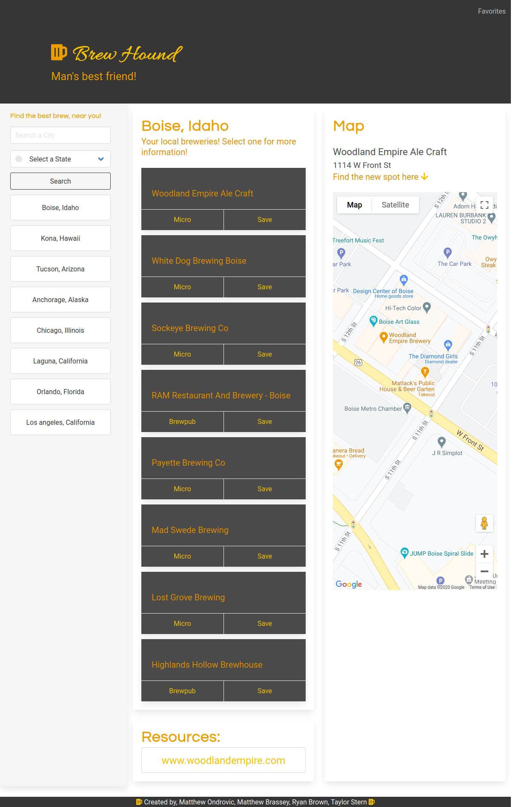

## Brew Hound

We are a website that allows users to easily find local breweries in your area! Simple as that. Our purpose and promise? We take the hassle out of searching and comparing breweries - we handle that, and we promise to give you the best and local results to get you on your way! See the full MERN stack version of this application here: [Brewhound-2](https://github.com/MBrassey/brewhound-2)!

<h6>
:cyclone: Click the image(s) below to view the live <a id="Screenshots" href="https://mbrassey.github.io/BrewHound/">webapplication</a>
</h6>

[
](https://mbrassey.github.io/BrewHound/)

### Brought to you by the following creators:

#### Matthew Ondrovic

> Creator of implementing APIs and handling DOM.
#### Matthew Brassey

> Creator of saved searches to LocalStorage, draggable/sortable/clickable/deletable Buttons, trash can Animation & Site Responsiveness. The "Resources" & the above "Map" data functionality. Coined app Name "Brew Hound".
[
](https://github.com/ryanabrown14/brew-hound/graphs/contributors)
#### Ryan Brown

> Creator of implementing BULMA into our HTML, styling the dynamically created elements, creating event listeners, creating slideshow format.
#### Taylor Stern

> Creator of broad CSS styling, other visual touch-ups, the README file, and editing slideshow.

#### Questions

Contact me at [matt@brassey.io](mailto:matt@brassey.io) with any questions or comments.

#### License

`BrewHound` is published under the __CC0_1.0_Universal__ license.

> The Creative Commons CC0 Public Domain Dedication waives copyright interest in a work you've created and dedicates it to the world-wide public domain. Use CC0 to opt out of copyright entirely and ensure your work has the widest reach. As with the Unlicense and typical software licenses, CC0 disclaims warranties. CC0 is very similar to the Unlicense.
