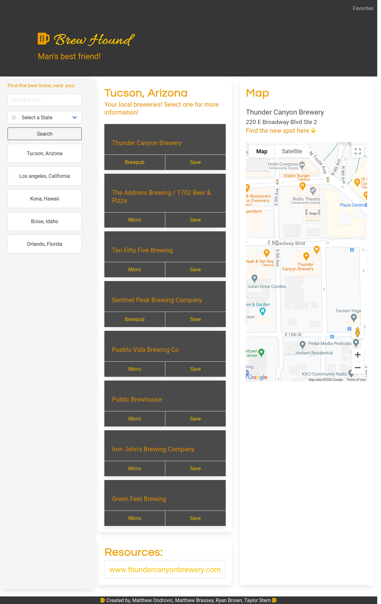
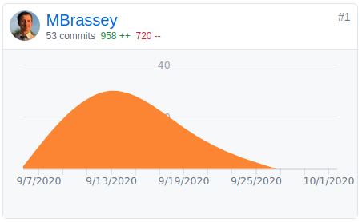

# Brew Hound

> We are a website that allows users to easily find local breweries in your area! Simple as that.
> Our purpose and promise? We take the hassle out of searching and comparing breweries - we handle that, and we promise to give you
> the best and local results to get you on your way!

[
](https://mbrassey.github.io/BrewHound/)

### :cyclone: Check it out! - https://mbrassey.github.io/BrewHound/

### Brought to you by the following creators:

#### Matthew Ondrovic
> Creator of implementing APIs and handling DOM.
#### Matthew Brassey
> Creator of saved searches to LocalStorage, draggable/sortable/clickable/deletable Buttons, trash can Animation & Site Responsiveness. The "Resources" & above map data functionality. 
[
](https://github.com/ryanabrown14/brew-hound/pulse)
#### Ryan Brown
> Creator of implementing BULMA into our HTML, styling the dynamically created elements, creating event listeners, creating slideshow format.
#### Taylor Stern
> Creator of broad CSS styling, other visual touch-ups, the README file, and editing slideshow.